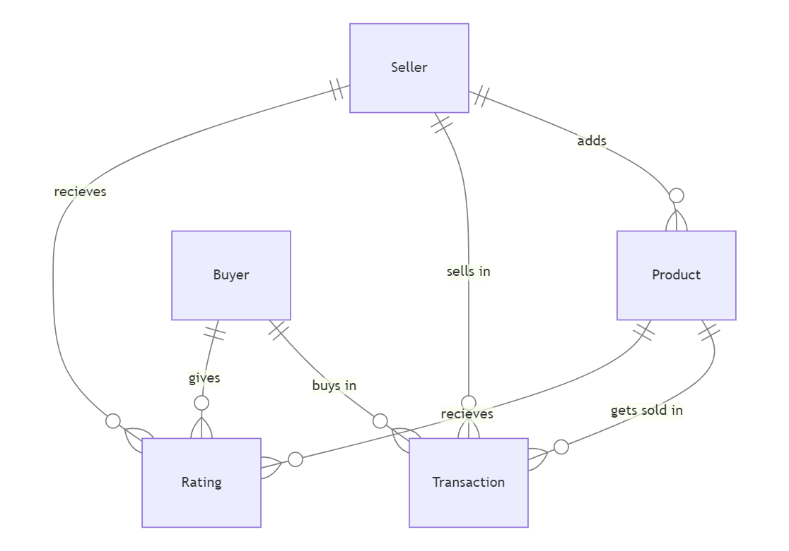

# Design Document

By Yunus Emre Atçeken

Video overview: <URL [HERE](https://www.youtube.com/watch?v=VGMuim8lEaA)>

## Scope

This database is for an online shopping site where at first you sign up as either a seller or a buyer. It stores account information on different tables depending on the account's
type. The information about products added by sellers is also stored in this database. It is also capable of tracking transactions and ratings given by buyers to sellers
and the products. As such, included in the database's scope is:

Sellers, including their account information
Products, including basic identifying information and their average ratings
Buyers, including their account information
Transactions, including information about buyer, seller, product and the time at which the transaction occured
Ratings, including information about the given rating to the product and the seller by the buyer

Out of scope are elements like refunds and some non-core attributes.

## Functional Requirements

This databese will support:

* CRUD operations
* Tracking live average rating of a product
* Soft deletions of seller and buyer accounts

Note that in this iteration, the system will not support sellers rating buyers.

## Representation

Entities are captured in SQLite tables with the following schema.

### Entities

The database includes the following entities:

#### Seller accounts

The `seller_accounts` table includes:

* `id`, which specifies the unique ID for the account as an `INTEGER`. This column has the `PRIMARY KEY` constraint applied.
* `first_name`, which specifies the seller's first name as `TEXT` as this is optimal for name fields.
* `last_name`, which specifies the seller's last name as `TEXT` for the same reason as `first_name`.
* `e-mail`, which specifies e-mail address of the seller as `TEXT`. Because e-mail addresses are best represented as `TEXT`. A `UNIQUE` constraint ensures no two accounts have the same e-mail address and a `CHECK` constraint is applied to ensure that the given e-mail address contains '@' sign.
* `password`, which specifies the account's password as `TEXT` as this is optimal for passwords. A `CHECK` constraint is applied to ensure the password length is greater than or equal to eight.
* `age`, which specifies the seller's age as an `INTEGER` as we are trying to store their age in years. A `CHECK` constraint is applied to ensure account owner is 18 or older.
* `country`, which specifies the country seller currently lives in as `TEXT` as we are trying to store the name of the country.
* `city`, which specifies the city seller currently lives in as `TEXT` as we are trying to store the name of the city.
* `deleted`, which specifies account's status as an `INTEGER` as this is optimal for boolean types in SQLite. BY default `deleted` = 0, as denoted by `DEFAULT 0` and a `CHECK` constraint is applied to ensure that `deleted` is either 0 or 1.

#### Products

The `products` table includes:

* `id`, which specifies the unique ID for the product as an `INTEGER`. This column has the `PRIMARY KEY` constraint applied.
* `seller_id`, which is the ID of the seller account which added the product into the site as an `INTEGER`. This coulumn has the `FOREIGN KEY` constraint applied, referencing
the `id` column in the `seller_accounts` table to ensure data integrity.
* `name`, which  specifies the name of the product as `TEXT` as this is optimal for name fields.
* `category`, which specifies the product's category as `TEXT` as we are trying to store the name of the category.
* `subcategory`, which specifies the product's subcategory as `TEXT` as we are trying to store the name of the subcategory.
* `description`, which specifies the description for the product as `TEXT` as this could be a long pharagraph too this is the best way to store this information.
* `price_$`, which specifies the price for the product in dollars as `REAL` as we are trying to store the price more accurately.
* `rating`, which specifies the average rating of a product as `REAL` as we are trying to store the average rating more accurately. 
By default `rating` = 0.0, as denoted by `DEFAULT 0.0`.

#### Buyer accounts

The `buyer_accounts` table includes:

* `id`, which specifies the unique ID for the account as an `INTEGER`. This column has the `PRIMARY KEY` constraint applied.
* `first_name`, which specifies the buyer's first name as `TEXT` as this is optimal for name fields.
* `last_name`, which specifies the buyer's last name as `TEXT` for the same reason as `first_name`.
* `e-mail`, which specifies e-mail address of the buyer as `TEXT`. Because e-mail addresses are best represented as `TEXT`. A `UNIQUE` constraint ensures no two accounts have the same e-mail address and a `CHECK` constraint is applied to ensure that the given e-mail address contains '@' sign.
* `password`, which specifies the account's password as `TEXT` as this is optimal for passwords. A `CHECK` constraint is applied to ensure the password length is greater than or equal to eight.
* `age`, which specifies the buyer's age as an `INTEGER` as we are trying to store their age in years. A `CHECK` constraint is applied to ensure account owner is 18 or older.
* `country`, which specifies the country buyer currently lives in as `TEXT` as we are trying to store the name of the country.
* `city`, which specifies the city buyer currently lives in as `TEXT` as we are trying to store the name of the city.
* `deleted`, which specifies account's status as an `INTEGER` as this is optimal for boolean types in SQLite. BY default `deleted` = 0, as denoted by `DEFAULT 0` and a `CHECK` constraint is applied to ensure that `deleted` is either 0 or 1.

#### Transactions

The `transactions` table includes:

* `id`, which specifies the unique ID for the transaction as an `INTEGER`. This column has the `PRIMARY KEY` constraint applied.
* `seller_id`, which is the ID of the seller in the transaction as an `INTEGER`. This coulumn has the `FOREIGN KEY` constraint applied, referencing the `id` column in the `seller_accounts` table to ensure data integrity.
* `product_id`, which is the ID of the product in the transaction as an `INTEGER`. This coulumn has the `FOREIGN KEY` constraint applied, referencing the `id` column in the `products` table to ensure data integrity.
* `buyer_id`, which is the ID of the buyer in the transaction as an `INTEGER`. This coulumn has the `FOREIGN KEY` constraint applied, referencing the `id` column in the `buyer_accounts` table to ensure data integrity.
* `date_time`, which specifies when the transaction is made as `NUMERIC`. Timestamps in SQLite can be conveniently stored as `NUMERIC`. The default value of `date_time` is 
current timestamp, as denoted by `DEFAULT CURRENT_TIMESTAMP`.

#### Ratings

The `ratings` table includes:

* `id`, which specifies the unique ID for the rating as an `INTEGER`. This column has the `PRIMARY KEY` constraint applied.
* `seller_id`, which is the ID of the seller recieving the rating as an `INTEGER`. This coulumn has the `FOREIGN KEY` constraint applied, referencing the `id` column in the `seller_accounts` table to ensure data integrity.
* `product_id`, which is the ID of the product recieving the rating as an `INTEGER`. This coulumn has the `FOREIGN KEY` constraint applied, referencing the `id` column in the `products` table to ensure data integrity.
* `buyer_id`, which is the ID of the buyer giving the rating as an `INTEGER`. This coulumn has the `FOREIGN KEY` constraint applied, referencing the `id` column in the `buyer_accounts` table to ensure data integrity.
* `given_rating`, which specifies the rating given by the buyer to both the seller and the product as `REAL` as we are trying to store given rating more accurately. A `CHECK` constraint is applied to ensure given rating is between the values 1.0 and 5.0 inclusively.

### Relationships

The below entity relationship diagram describes the relationships among the entities in the database.

As detailed by the diagram:

* One seller is capable of adding 0 to many products. 0, if they have yet to add any product to the site and many if they add more than one product. A product is only added by one
and only one seller.
* One seller is capable of selling in 0 to many transactions. 0, if they have yet to sell any product and many if they sell more than one product. A transaction only contains one and
only one seller.
* One seller is capable of recieving 0 to many ratings. 0, if they have yet to recieve any rating and many if they recieve more than one rating. A rating is only recieved by one and
only one seller.
* One product may get sold in 0 to many transactions. 0, if they are yet to be sold and many if they are sold more than one time. A transaction only contains one and only one product.
* One product is capable of recieving 0 to many ratings. 0, if they have yet to recieve any rating and many if they recieve more than one rating. A rating is only recieved by one and
only one product.
* One buyer is capable of buying in 0 to many transactions. 0, if they have yet to buy any product and many if they buy more than one product. A transaction only contains one and only one buyer.
* One buyer is capable of giving 0 to many ratings. 0, if they have yet to give any rating and many if they give more than one rating. A rating can only be given by one and only one buyer.

## Optimizations

For live updating of the average rating of a product, a trigger `update_rating` is created.
For finding top 100 sellers by the amount of products they have sold while anonymising their last names, a view `top_dealers` is created.
For finding top 100 products by the amount of income they have generated an the amount of income itself, a view `top_earning_products` is created.

As searching a product by name, category, and subcategory will be common, indexes are created on `name`, `category`, `subcategory` columns of the `products` table to speed up the searches for products by those columns.
As an e-mail has to be unique in both seller accounts and buyer accounts it will be common to search accounts by e-mail. Also e-mails will be used for logging into the site as well
which makes it important to speed up the process. For these reasons indexes are created on `e-mail` columns of both `seller_accounts` and `buyer_accounts` tables. 

## Limitations

The current schema does not contain information on stock of a product and even though it contains location information, does not contain the exact addresses of sellers and buyers.
These informations would require addition of extra columns to certain tables.

